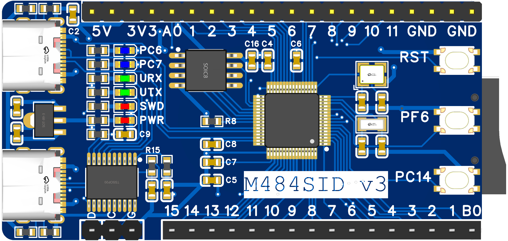

# M484SID
M484SID demo board, used for code testing.

view board Sch & PCB online: [https://oshwhub.com/xivn1987/M484SID](https://oshwhub.com/xivn1987/M484SID)

onboard DAPLink firmware source: [https://github.com/XIVN1987/DAPLink](https://github.com/XIVN1987/DAPLink)

micropython port: [https://github.com/XIVN1987/micropython/tree/m480](https://github.com/XIVN1987/micropython/tree/m480)

