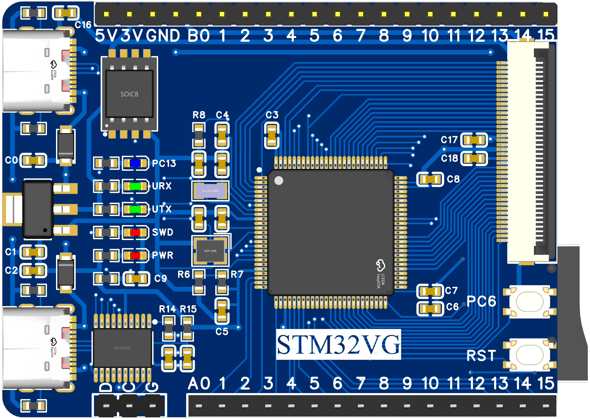

# STM32VG
STM32F405VG demo board, used for code testing.

view board Sch & PCB online: [https://oshwhub.com/xivn1987/stm32vg](https://oshwhub.com/xivn1987/stm32vg)

onboard DAPLink firmware source: [https://github.com/XIVN1987/DAPLink](https://github.com/XIVN1987/DAPLink)

